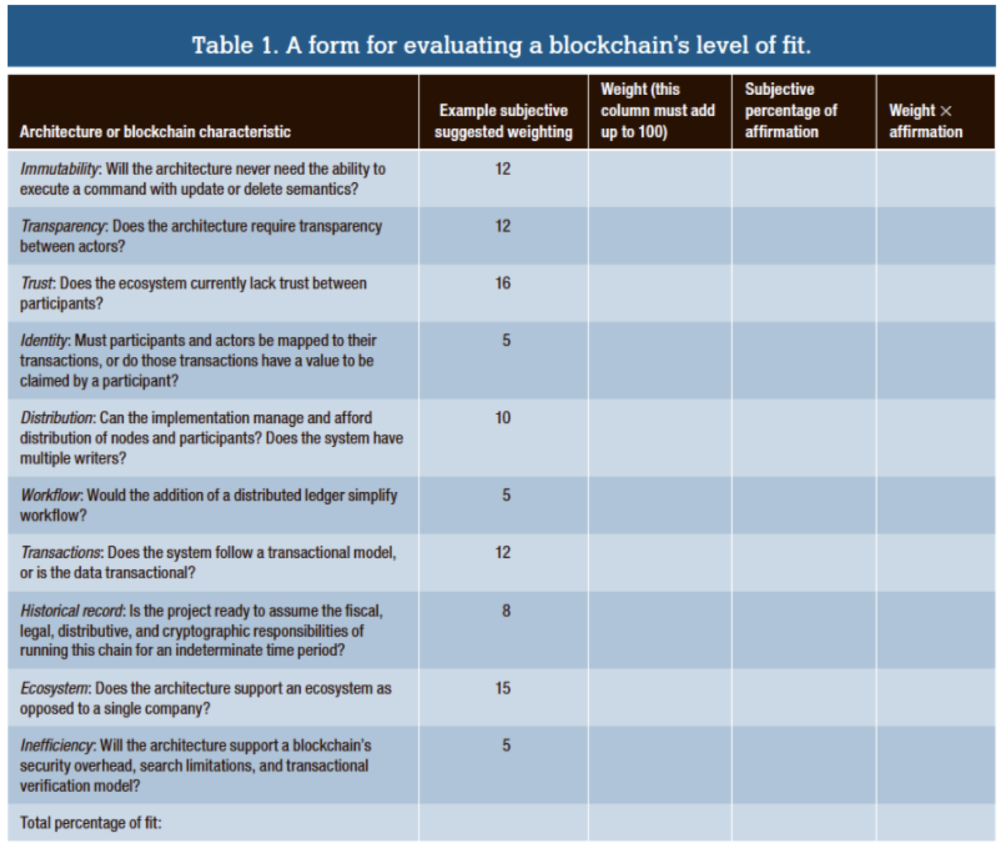
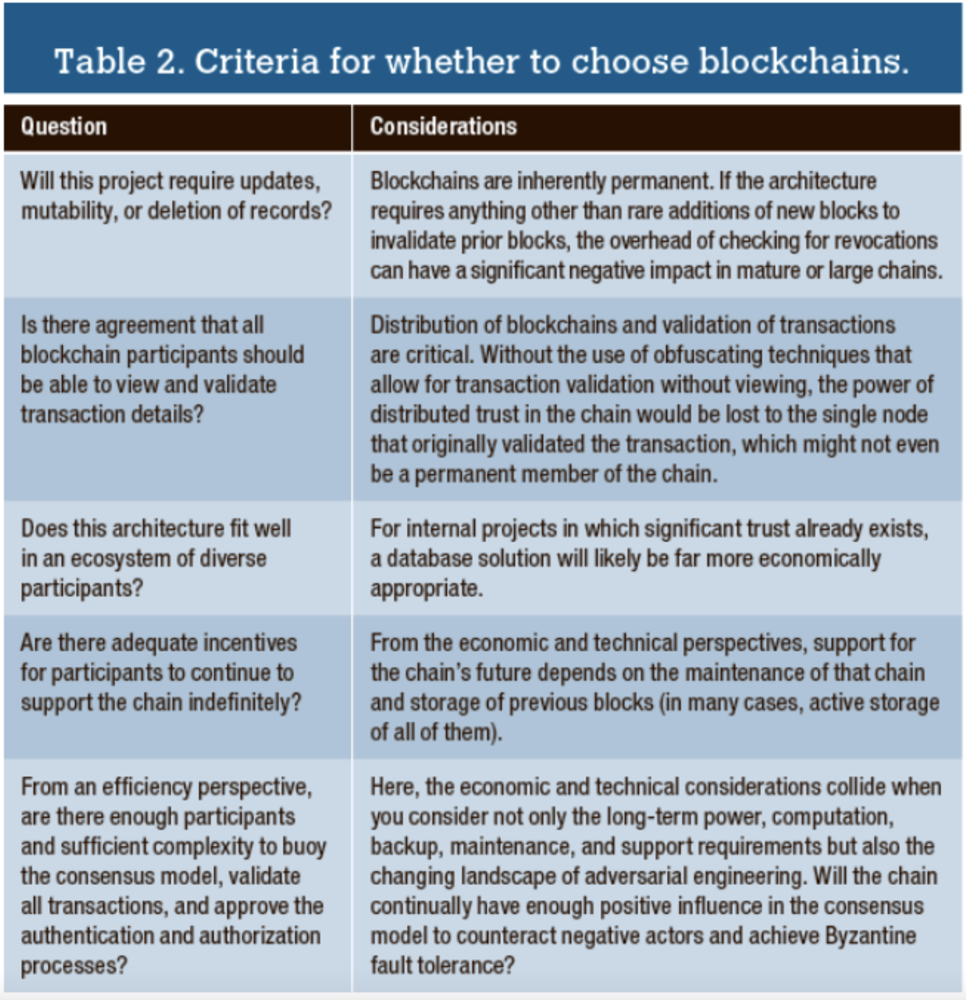

# Architecture and Design of Blockchain Applications

We have the following requirements for software architectures:
- Functional requirements
- Quality attributes
- Constraints

Blockchains have these fundamental properties:
- Immutability
- Non-repudiation
- Data integrity
- Equal rights (non-permissioned blockchain)
- Trust 

Before we can start to code our application we need to assess the design process, which follows the following assessments:
- Suitability of blockchain
- Architecture
- Technology

Suitability takes a look on when a blockchain should be used:
- Is high data throughput required? If yes, use a traditional database.
- Are updates centrally controlled? If yes, use a traditional database.
- Do users trust each other? If yes, use a traditional database.
- Are users anonymous? If yes, use a public blockchain, else use a private blockchain.
- Is consensus maintained by consortium? If yes, use private blockchain, else use public blockchain.

We should also ask these questions:
- What is being decentralized?
- What level of decentralization is required?
- What blockchain is used?
- What security mechanisms are used?

For blockchain applicability we have:
- Immutability (through cryptography and distribution), which is expensive.
- Can a database accomplish the architecture’s design goals?
- Can user roles and restrictions in the database deliver the functionality required?
- Do the proof-of-work, proof-of-stake, and consensus model align with the architectural and financial goals?
- Can node signing and shared responsibilities accomplish the same goals as a complex consensus model?
- What is a mistake is made and a correction is required?
- What is there’s a desire to remove a record at some point?

See table in task 1.

## Questions

- When does it make sense to use a blockchain over a traditional database?
  - When you have multipe different users where trust is low or they want to share responsibility of the process
  - Data transparency
  - When you want to use decentralization
  - When you want anonymity
- What are the levels of decentralization?
  - Public / permissioned