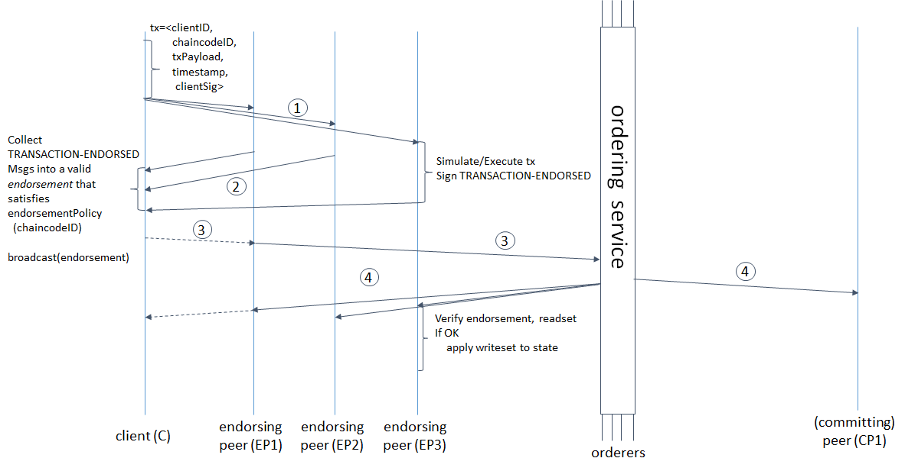
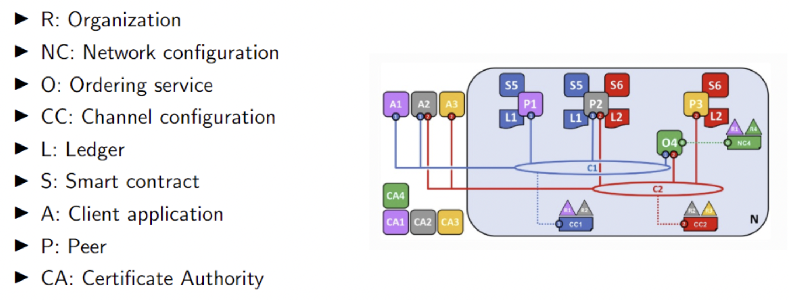

# Hyperledger

- What is hyperledger and how does it differ from bitcoin and ethereum?
- How does it work?
- Blocks, consensus
- Execute-order-validate instead of order-execute

When creating a Hyperledger network we need to:
- Create the basis for the network
  - Adding Certificate Authority
  - Adding network configuration
  - Adding an organization to the network configuration
  - Adding an orderer for the network configuration to use
- Add network administrators
- Define consortium
- Create a channel
- Connecting Peers
- Install chaincode
- Add applications

## Transaction flow

1. Client broadcasts transaction proposal to peers
2. Peers invoke and execute the proposal through shared chaincode
   1. On success: Transaction is endorsed
3. Return endorsed transaction back to client
4. Client sends **endorsed** transaction to ordering service nodes
5. Ordering nodes receive the request
6. The ordering nodes collaborate and order the incoming transactions
7. Block is committed to the blockchain
8. Block is returned to listening peers (in the same channel)
9. Peers validate all transactions against endorsement policy
   1.  Should a transaction fail validation, peers will mark it as invalid
10. Each peer appends the block to the channel's chain and every valid transaction is added to the will be comitted to the state datebase.
11. Client is notified

Source: [Transaction Flow](https://hyperledger-fabric.readthedocs.io/en/release-2.2/txflow.html)

## Overview

### Organizations

- These are known as the members of the blockchain network
- They are invited to join by the network provider
- They are joined by adding the organizations MSP to the network
- Can range from individual to large corporations
- A number of organizations constitutes a consortium

### Network configuration

- Contains the policies that describe the starting set of administrative capabilities for the network
- Initially only the organization has rights over the network

### Orderer

- A defined collective of nodes
- Orders transactions into a block
- Distributes blocks to connected peers
- Validates and commits
- Supports pluggable implementations

### Certificate Authorities (CA) and MSPs (Membership service provider)

- Issue certificates to administrators and network nodes
- Dispenses X509 certificates to identify components as belonging to organization
- Different components of the blockchain network use certificates to identify themselves to each other as being from a particular organization
- Usually more than one CA supporting a blockchain network
- Different organizations often use different CAs
- MSP maps certificates dispensed by the CA to member organizations
- Associates certificate holders with organization

### Certificate Authorities

A chain of trust is established between a Root CA and a set of Intermediate CAs. The important thing here is that the issuing CA for the certificates is the Root CA or has a chain of trust to the Root CA.

### Membership Service Provider

The MSP identifies which Root CAs and Intermediate CAs that are accepts to define the members of a trusted domain. This is done by listing the identities of their members or by identifying which CAs are authorised to issue valid identities for their members.

### Fabric member

The identity of the fabric member is issued by a CA that is trusted by the network. Membership is achieved by adding the member’s public key to the organization’s MSP.

## Daniel

Hyperledger is a permissioned blockchain. A permissioned blockchain, compared to a permissionless blockchain, contains only identified participants. This type of blockchain provides a secure way of interactions between participants who do not necessarily trust each other by utilising Byzantine fault tolerance. 

Hyperledger Fabric components are divided into the following:
Membership service provider, which defines rules for how identities are allowed access to the network. Here is a Certificate Authority used.
Organisations can have certain rights, as issuing certificates and endorsing transactions.

Clients are applications that can propose transactions to the blockchain. 
Peer nodes are like regular nodes. They can commit transactions, maintain the state, run chaincode, and have a copy of the ledger.
Nodes can be authorised to connect to multiple channels. Each channel works as a blockchain.

Orderer provides the consensus protocol to order the transactions submitted by the clients and peers.
Chaincode is Hyperledger Fabrics type of smart contract.

Bitcoin and Ethereum are permissionless blockchains which means that anyone can participate in their respective networks. Hyperledger Fabric, on the other hand, is permission-based, which means that each participant needs to be identified as a valid participant before they can participate. In Hyperledger, do transactions need to be endorsed to be valid. The endorsement happens between the organisations involved in the transaction.

## Niels

### What is Hyperledger Fabric?

Hyperledger Fabric is a permissioned blockchain framework backed by many larger corporations, most notably  IBM, Xiaomi, American Express, and many more. Hyperledger caters to the industry and aims to provide a solution for companies to incorporate blockchain into their infrastructure that accounts for authentication and authorization by the different actors on the network.

The Hyperledger Fabric network contains many different nodes, called peers, that are tied to an organization. The framework also supports various programming languages (Node, GoLang, and Java), allowing developers to jump right in.

### What are the fundamental components of Hyperledger Fabric, and what are the responsibilities of the different components?

The Hyperledger Fabric network contains many different elements, such as:
Certificate Authorities are responsible for issuing certificates for organizations that are participating within the network. Organizations connecting to the network will have to provide an X.509 digital certificate to authenticate. 
Organizations are considered to be members of the network; they vary in size. Once an organization has joined a network, members of the organization can operate within the network, to the extent of the organization's certificate, by authenticating with their public key.
Channels allow different contracts to be deployed apart from each other, making it easy to separate access between members, which makes a lot of sense when you have multiple organizations, and you don't want them to access everything within the network. Each channel has its separate ledger.
Peers are essentially nodes on a given channel that hold a copy of the blockchain. Using the channel, they can communicate with participant peers and query the world state.
Orderer is a unique phenomenon within the framework. An ordering node on the network exists and, as the name suggests, orders the transaction within the different channels/ledgers.
Chaincode / Smart Contracts is the actual code executed on the peers of the network, validated and endorsed. Chaincode can consist of multiple smart contracts.
Applications are interfaces that users use to interact with the underlying blockchain.

### How does Hyperledger Fabric differ from Bitcoin and Ethereum?

Hyperledger Fabric is widely different when compared to traditional blockchains such as Bitcoin and Ethereum. The latter two are public blockchains that roam within a trustless environment, which means special consensus algorithms have to be implemented to secure the blockchain's integrity and guarantee consistency. Hyperledger Fabric being permissioned means an inherent trust between participating users on the blockchains since they need to authenticate to access the network.

The consensus algorithm found within Bitcoin and Ethereum is also responsible for ordering and creating blocks within their respective networks. 
Such an algorithm doesn't exist within Hyperledger Fabric, so it uses an ordering service, which both orders transactions within each blockchain and bundles them into a block when need be. 
Forks in the blockchain are not possible within Hyperledger Fabric, as transactions are either validated by all members and committed onto the blockchain or discarded. 

When chaincode is updated, the compiled code needs to be deployed on each peer within the blockchain. This approach is widely different from Bitcoin and Ethereum, where the actual code is part of the transaction and then run by nodes. Within Hyperledger Fabric, only the params of the methods are pushed onto the blockchain, and the participating nodes then execute the contract with the given input and endorse the transaction if it succeeds. 

## Questions

- What does it mean to be a private/permissioned blockchain?
  - You need authentication and authorization to transact on it
- How does Hyperledger process transactions compare to bitcoin & ethereum?
  - Bitcoin and ethereum use order, execute where hyperledger utilise execute, order, and validate, (state changes committed).
- What does it mean that Hyperledger's consensus is deterministic?
  - Before transactions are broadcasted in hyperledger, they are endorsed. After endorsement they are ensured to be included within the blockchain - this is very different from a public blockchain, where the algorithm is probablistic.
- What is the batch size?
  - Number of transactions a block can hold
- What is the batch timeout?
  - Time to wait before batching the transactions into a block
- Why are CA's neccessary?
  - They create certificates that clients use to authenticate with the network
- What is an endorsement policy?
  - It determines how many peers should agree to a "proposal" (transaction), are set on a channel basis.
- What is replay-attack protection?
  - Endorsing nodes ensure a transaction hasn't already been submitted, thus disallowing double spending.
- What is an MSP?
  - Membership Service Provider, despite the name, just a folder of "accepted" certificates. The MSP contains a list of permissioned identities, whereas Certificate Authorities generate the certificates that represent identities.
- Who turns an identity into a role?
  - The MSP
- What are organizations?
  - A grouping of peers. Peers belong to organization. 
- What are network configurations?
  - Configures settings as order relationship (with channels).
- What is the ordering service?
  - It orders transactions into a block and distributes blocks to connected peers.
- What is a channel configuration?
- What is the ledger?
  - A ledger is the combination of the world state and the blockchain
- What is a smart contract?
  - A smart contract in hyperledger is defined by chaincode. Multiple smart contracts can be defined within the same chaincode. When chaincode is deployed all smart contract within it are made available to the applications.
- What is a client application?
  - Applications that interact with the blockchain
- What is a peer?
  - An identify/user interacting with the blockchain
- What is a certificate authority?
  - In charge of issuing certificates that allow access to the blockchain. Each member receives one root certificate.
- How does the blockchain affect the world state?
  - As the blockchain is changing over time, the lastest state is updated within the world state.
- How many ledgers are there?
  - One for each channel. Peers participating in multiple channels therefore have multiple ledgers.
- What 5 things does the network comprise of?
  - Channels, peers, smart contracts (chaincode), ledgers, ordering services
- Is the orderer service strictly required?
  - No, but you need to find a different consensus strategy if you remove it.